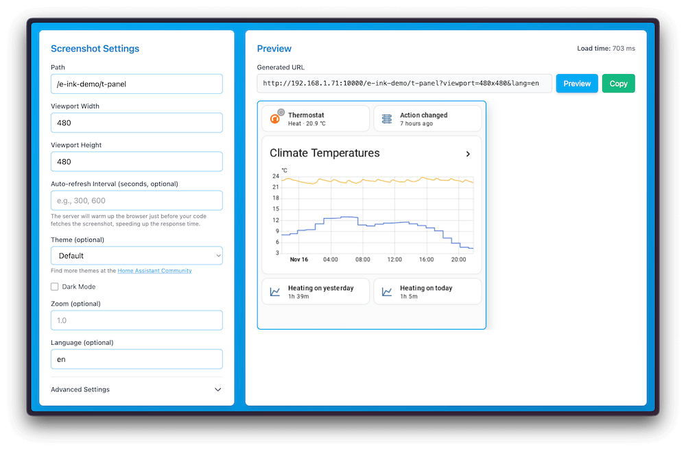

Everything in this repository is experimental and just a playground.

## Puppet

Easily create screenshots of your Home Assistant dashboards. Allowing you to put them on e-ink screens or any other screen that can display images.

[Read the README](https://github.com/balloob/home-assistant-addons/blob/main/puppet/README.md) to ensure you educate yourself about all the options.

### Manual usage

If your Homeassistant installation cannot digest clicking the badge above, you can still run puppet manually. After all it is provided as docker container image.
Be aware these instructions are step by step, but you may want to first read all then decide on the sequence.

Ensure you have a docker host and can run a command like

    docker run --rm -p 10000:10000 -v ./options-dev.json:/app/options-dev.json ghcr.io/balloob/home-assistant-addons:latest

You should see a prompt on the console saying "Visit server at http://localhost:10000". Do so and you should see the above image.

For this to succeed you will have to create the options file named options-dev.json. It shall have the following content:

    {
      "home_assistant_url": "http://localhost:8123",
      "access_token": "<token>",
      "chromium_executable": "/usr/bin/chromium",
      "keep_browser_open": false
    }

For this file to be useful you will need to provide a Homeassistant access token. If you do not know how to obtain one, follow these steps:

- Log in to Home Assistant: Access your Home Assistant instance through a web browser.
- Navigate to your User Profile: In the Home Assistant web interface, locate and click on your username or circular icon, usually found at the very bottom of the sidebar. This will take you to your User Profile page.
- Find the Long-Lived Access Tokens section: Switch to the Security tab in your profile and scroll down. You will find a section specifically for "Long-Lived Access Tokens."
- Create a New Token: Click on the "Create Token" button. You will be prompted to give the token a name. Provide a descriptive name that helps you identify its purpose (e.g., "puppet access token").
- Copy the Token: After clicking "OK," Home Assistant will generate and display your new long-lived access token. It is crucial to copy this token immediately as it will only be shown once and cannot be retrieved again. Store it securely. Long-lived access tokens are valid for 10 years. 
