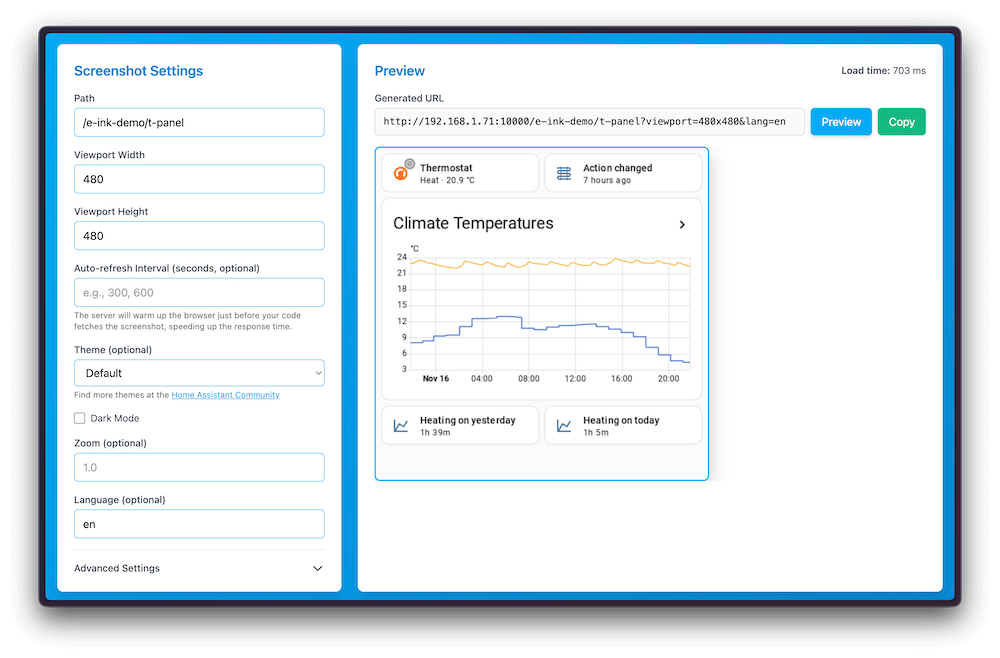

Everything in this repository is experimental and just a playground.

It currently contains two Home Assistant add-ons:

- **Puppet**: create screenshots of your Home Assistant dashboards for e-ink displays and other image-based surfaces.
- **OpenDisplay Wi-Fi**: run an OpenDisplay Wi-Fi server so compatible e-paper displays on your network can discover it and receive images.

## Puppet

Easily create screenshots of your Home Assistant dashboards. Allowing you to put them on e-ink screens or any other screen that can display images.

[Read the Puppet README](./puppet/README.md) to ensure you educate yourself about all the options.

## OpenDisplay Wi-Fi

Run an [OpenDisplay](https://opendisplay.org) Wi-Fi server as a Home Assistant add-on. E-paper displays on your network will automatically discover the server via mDNS and connect to receive images.

[Read the OpenDisplay Wi-Fi README](./opendisplay-wifi/README.md) for setup and usage details.

